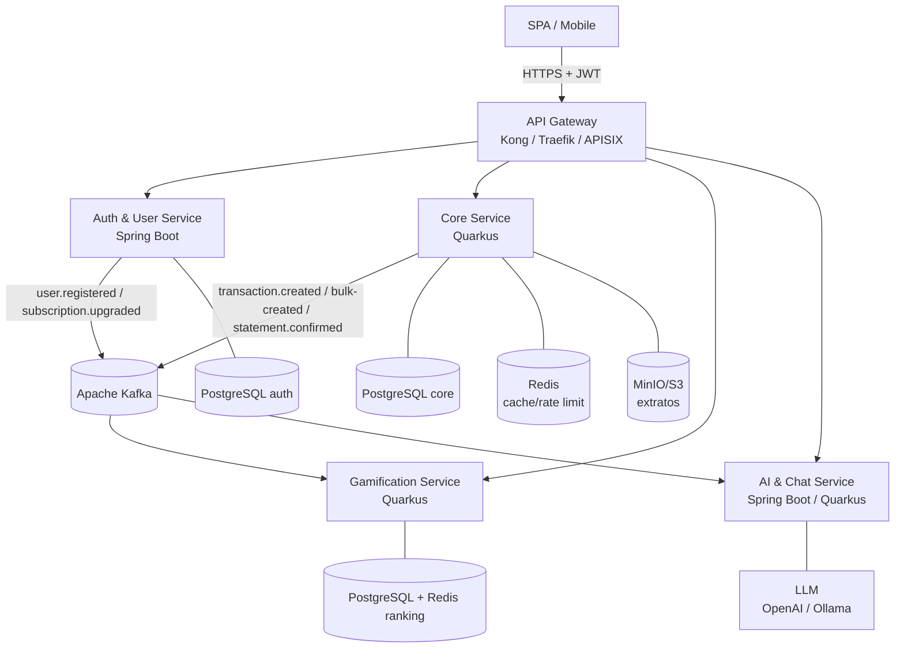
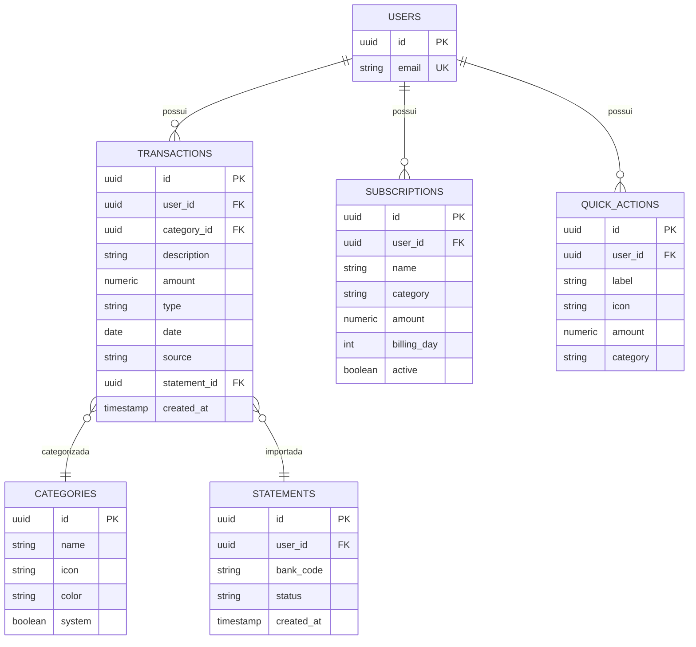
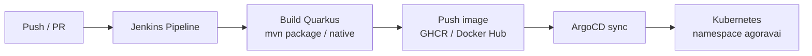

# Agora Vai — Arquitetura do Core Service (Quarkus)

> **Status:** Proposta técnica para implementação oficial (pós-remoção de mocks)
> **Stack do core:** Java 21 + Quarkus + PostgreSQL + Redis + Kafka
> **Referência de contratos:** `endpoints-arquitetura.md` (versão 1.0.0)

---

## 1. Contexto e estado atual

| Camada | Situação | Observação |
|---|---|---|
| Frontend | TanStack Start + React 19 + Vite | Consumia dados **mockados** em memória |
| Auth | Firebase Auth (client) + Spring Boot (backend `/users/me`) | Já é real e funcional |
| Dados (transações, assinaturas, insights, gamificação, admin, NLP, extrato) | **Mock** | Substituídos por clientes HTTP reais nesta etapa |
| Infra | VPS + Kubernetes + Jenkins (CI/CD) | Ver seção 9 |

### 1.1 Mocks removidos (inventário)

| Arquivo/rota | Mock removido | Substituído por |
|---|---|---|
| `services/api.ts` | Cliente HTTP fake (`setTimeout` + resolve body) | `fetchWithAuth` real com prefixo `/api/v1` |
| `services/transactions.ts` | 8 lançamentos seed + store em memória | `GET/POST/DELETE /api/v1/transactions` |
| `services/subscriptions.ts` | 4 assinaturas fake | `GET/POST/PATCH/DELETE /api/v1/subscriptions` |
| `services/insights.ts` | 5 insights hardcoded | `POST /api/v1/ai/insights` |
| `services/admin.ts` | Métricas fake (seno/cosseno) | `GET /api/v1/admin/metrics` |
| `services/gamification.ts` | Perfil/missões/ranking/recompensa fake + `applyXp` local | Endpoints `/api/v1/gamification/*` |
| `services/quick-actions.ts` | 4 atalhos seed | `GET/POST/DELETE /api/v1/quick-actions` |
| `services/statement-import.ts` | Parser mock de extrato | `POST /api/v1/transactions/statement/upload` (multipart) |
| `services/nlp.ts` | Parser local + endpoint fake | `POST /api/v1/ai/nlp/parse-transaction` |
| `routes/app.index.tsx` | Gráfico "Fluxo de caixa" com valores fixos | Agregação dos lançamentos reais |
| `routes/admin.tsx` | Label "(mock)", "+8,4%", contagens fixas | Valores vindos do endpoint |
| `routes/app.insights.tsx` | Botão "(demo) ativar Pro agora" | Removido |

> **Catálogos estáticos mantidos** (`CATEGORIES`, `TIERS`, lista de bancos, sugestões do chat):
> não são dados de usuário, são configuração de produto. A evolução natural é
> serví-los via `GET /api/v1/categories` e `GET /api/v1/gamification/tiers`,
> mantendo o frontend como fallback.

---

## 2. Objetivo

Criar o **Core Service** em **Java Quarkus**, dono da lógica de negócio real do
produto:

- **Lançamentos** (transações) — CRUD, importação e conciliação de extrato.
- **Assinaturas** — CRUD e recorrência mensal.
- **Dashboard** — KPIs e séries temporais calculadas no servidor.
- **Insights** — (integração com o serviço de IA) ou cálculo determinístico.
- **Categorias / Quick actions** — catálogo por usuário.
- **Eventos de domínio** — publicação em Kafka para gamificação e analytics.

O **Auth Service (Spring Boot)** continua sendo o provedor de identidade e
plano (FREE/PRO). O core confia no JWT validado no gateway.

---

## 3. Por que Quarkus (e quando vale a pena)

- **Boot rápido + GraalVM Native:** ideal para cenários com picos de uso e
  scale-to-zero em Kubernetes (startup < 100ms em imagem nativa).
- **Ecossistema integrado:** `quarkus-hibernate-reactive`/Panache,
  `quarkus-smallrye-reactive-messaging` (Kafka), `quarkus-rest-client`,
  `quarkus-redis-client`, `quarkus-amazon-s3` (MinIO), OpenTelemetry nativo.
- **Perfil Kubernetes-first:** health checks (`/q/health`), métricas
  (`/q/metrics`), config por ambiente (`application-*.properties`), menor
  footprint de memória vs. Spring Boot tradicional.
- **Developer experience:** dev mode com hot reload, testes com containers
  (Testcontainers), build de imagem nativa via `quarkus build --native`.

> **Quando NÃO usar Quarkus:** se a equipe já domina Spring e o serviço é
> pequeno/CRUD simples, o ganho pode não compensar o custo de aprendizado.
> Como o core concentra cálculo e será o serviço de maior tráfego, o Quarkus
> entrega boa relação custo/performance na sua VPS.

---

## 4. Visão de microsserviços



### 4.1 Responsabilidades

| Serviço | Responsabilidade | Dono dos dados |
|---|---|---|
| **Auth & User (Spring)** | Identidade, plano (FREE/PRO), perfil | `users`, `plans` |
| **Core (Quarkus)** | Transações, assinaturas, dashboard, categorias, quick actions, extrato | `transactions`, `subscriptions`, `categories`, `quick_actions`, `statements` |
| **Gamification (Quarkus)** | XP, ligas, missões, ranking — **reativo via Kafka** | `gamification_profiles`, `missions` |
| **AI & Chat** | NLP de lançamentos e geração de insights | sem estado próprio (consome APIs) |

---

## 5. Contratos do Core Service

Prefixo no gateway: **`/api/v1`**. Todas as rotas exigem
`Authorization: Bearer <jwt>` (validado no gateway; o core recebe
`X-User-Id` ou decodifica o claim `sub`).

| Método | Rota | Descrição |
|---|---|---|
| `GET` | `/transactions` | Lista lançamentos do usuário (com paginação `?from&to&page&size`) |
| `POST` | `/transactions` | Cria um lançamento |
| `POST` | `/transactions/bulk` | Cria em lote (importação/confirmação) → `207 Multi-Status` |
| `DELETE` | `/transactions/{id}` | Remove um lançamento |
| `POST` | `/transactions/statement/upload` | Upload de extrato (OFX/CSV/PDF) → prévia de conciliação |
| `POST` | `/transactions/statement/{statementId}/confirm` | Confirma/ignora linhas do extrato |
| `GET` | `/subscriptions` | Lista assinaturas |
| `POST` | `/subscriptions` | Cria assinatura |
| `PATCH` | `/subscriptions/{id}` | Atualiza (ex.: ativar/pausar) |
| `DELETE` | `/subscriptions/{id}` | Remove assinatura |
| `GET` | `/dashboard` | KPIs + séries temporais calculadas no servidor |
| `GET` | `/categories` | Catálogo de categorias |
| `GET` | `/quick-actions` | Atalhos do usuário |
| `POST` | `/quick-actions` | Cria atalho |
| `DELETE` | `/quick-actions/{id}` | Remove atalho |
| `GET` | `/admin/metrics` | Métricas do SaaS (exclusivo admin) |

> Os payloads detalhados (exemplos JSON, códigos de erro RFC 7807) estão em
> `endpoints-arquitetura.md`. O frontend já foi alinhado a esses caminhos.

### 5.1 Exemplo — `GET /dashboard`

```json
{
  "period": { "from": "2026-06-01", "to": "2026-06-30" },
  "kpis": {
    "income": 6500.00,
    "expense": 3240.50,
    "balance": 3259.50,
    "savingsRate": 0.50
  },
  "cashflow": [
    { "month": "2026-01", "label": "Jan", "income": 6100, "expense": 3100 },
    { "month": "2026-02", "label": "Fev", "income": 6400, "expense": 3350 }
  ],
  "expensesByCategory": [
    { "category": "Alimentação", "value": 890.00 }
  ]
}
```

---

## 6. Modelo de dados (PostgreSQL — schema `core`)



**Índices recomendados:** `transactions(user_id, date)`,
`transactions(user_id, category_id)`, `subscriptions(user_id, active)`.

---

## 7. Eventos Kafka (integração com gamificação)

O core publica e **não** conhece a gamificação:

| Tópico | Evento | Gatilho |
|---|---|---|
| `transaction.created` | `TransactionCreatedEvent` | POST de lançamento |
| `transaction.bulk-created` | `BulkTransactionCreatedEvent` | POST bulk / confirmação de extrato |
| `statement.confirmed` | `StatementConfirmedEvent` | Confirmação de conciliação |

Envelope padrão (ver `endpoints-arquitetura.md` §3): `eventId`, `eventType`,
`version`, `source`, `correlationId`, `occurredAt`, `payload`.

---

## 8. Stack técnica recomendada (core)

| Área | Escolha | Justificativa |
|---|---|---|
| Linguagem | Java 21 (LTS) | Virtual threads + records + pattern matching |
| Framework | Quarkus 3.x | Startup rápido, GraalVM, reactive |
| Persistência | Hibernate Reactive + Panache (ou Hibernate ORM) | Simplicidade vs. throughput |
| Banco | PostgreSQL 16 | Transacional, JSONB para tags |
| Cache/ranking | Redis | Dashboard cacheado, rate limit |
| Mensageria | Kafka + SmallRye Reactive Messaging | Event-driven |
| Arquivos | MinIO (S3 API) | Extratos bancários |
| Observabilidade | OpenTelemetry + Micrometer + Prometheus/Grafana + Loki/Tempo | Traces, métricas e logs |
| Contratos | OpenAPI 3 gerada (`quarkus-smallrye-openapi`) + Pact (CDC) | Contrato entre FE/BE |
| Testes | JUnit 5 + Testcontainers + RestAssured | Testes de integração reais |

### 8.1 Ideias atuais de mercado (recomendações)

1. **GraalVM Native Image:** imagem pequena (~100–150 MB) e startup rápido;
   use o modo JVM em dev e nativo em produção.
2. **Event-driven core:** o core persiste e emite eventos; gamificação e
   analytics reagem de forma assíncrona (desacoplamento e resiliência).
3. **Cache de dashboard com Redis:** invalidação por evento (ex.: após
   `transaction.created`), evitando recalcular em toda requisição.
4. **Idempotência:** todo POST de transação recebe um `Idempotency-Key` para
   evitar duplicidade em retries (crítico com importação de extrato).
5. **Outbox Pattern:** grave o evento na mesma transação do dado
   (`outbox` table + Debezium/releitura) para não perder evento em falha.
6. **CDC (Contract Testing):** Pact entre o frontend e cada serviço no CI.
7. **OpenTelemetry end-to-end:** `X-Correlation-Id` propagado do gateway até o
   Kafka, visível no Grafana Tempo/Jaeger.
8. **Rate limit por plano no gateway** (Kong/APISIX/Traefik) — Free vs. Pro.
9. **GitOps com ArgoCD** (ou Flux) para deploy declarativo no seu Kubernetes.
10. **Feature flags** (Unleash/Flagsmith) para ativar endpoints do core por
    usuário/percentual durante a migração do mock para o real.

---

## 9. Infra atual e evolução sugerida

### 9.1 Estado atual

- **1 VPS básica** rodando Kubernetes (provavelmente k3s/single-node).
- **Jenkins** configurando o backend (pipeline de build/deploy).

### 9.2 Evolução recomendada (progressiva, sem trocar tudo de uma vez)



| Etapa | Ação |
|---|---|
| Namespaces | `agoravai-prod`, `agoravai-hom` para separar ambientes |
| Secrets | External Secrets / Sealed Secrets (nunca commitar credencial) |
| Ingress | Um único Ingress Controller (Traefik/NGINX) com TLS via cert-manager |
| Deploy | Jenkins só builda e publica imagem; o deploy vira **GitOps (ArgoCD)** |
| Health | Liveness/readiness em `/q/health` para reinício automático |
| Recursos | `requests`/`limits` baixos no core (Quarkus nativo consome pouco) |
| Backup | `pg_dump` agendado + snapshots do volume do PostgreSQL |

> **Curto prazo (menor risco):** manter Jenkins para build/test e usar
> `kubectl apply`/`helm` no deploy. Migrar para ArgoCD quando houver mais de
> um serviço com cadência de release.

---

## 10. Roadmap de implementação

| Fase | Entrega | Critério de aceite |
|---|---|---|
| **0 — Fundação** | Skeleton Quarkus, conexão Postgres, migração Flyway/Liquibase, OpenAPI, health | App sobe no K8s e responde `/q/health` |
| **1 — Categorias + Transações** | `GET/POST/DELETE /transactions`, `GET /categories` | Lançamentos reais substituem o mock |
| **2 — Assinaturas + Quick actions** | CRUD completo | Tela de assinaturas/atalhos 100% real |
| **3 — Dashboard** | `GET /dashboard` com agregações SQL | KPIs e gráfico vindos do servidor |
| **4 — Extrato** | Upload multipart + parsing (OFX/CSV/PDF) + conciliação | Importação real substitui parser mock |
| **5 — Eventos** | Outbox + Kafka para gamificação | XP/ranking reagem a eventos |
| **6 — Insights/NLP** | Integração com o serviço de IA | Insights Pro e chat com dados reais |
| **7 — Admin + Observabilidade** | `/admin/metrics`, métricas/traces | Painel admin real e observável |

---

## 11. Notas de migração (do que já foi feito no frontend)

- Os serviços frontend agora chamam `/api/v1/*` e **normalizam** a resposta do
  backend para os DTOs atuais da UI. Isso permite evoluir o backend sem
  reescrever as telas.
- `CATEGORIES` e `TIERS` continuam como fallback estático até os endpoints de
  catálogo existirem (Fase 1).
- O gráfico do dashboard calcula a partir dos lançamentos reais como
  intermediário; a fonte definitiva será `GET /dashboard` (Fase 3).
- Sem backend, as telas exibirão erro/empty state — comportamento esperado
  durante a implementação, sem dados fake.
